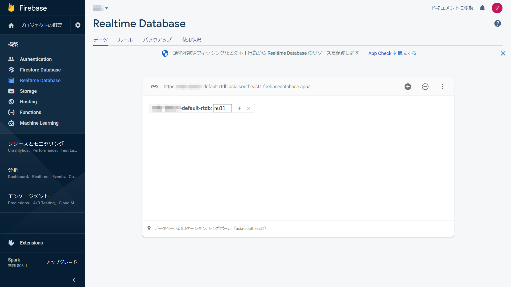

# 概要
- 20211013（水）13:05 〜
- Tello を音声で制御
- Google Home Mini + IFTTT + Firebase Realtime Database + Tello
- Node.js
<p></p>

# 参考サイト
- [Google Homeに話しかけてドローンを音声操作してみる](https://qiita.com/miso_develop/items/a482dc4d168ec0a33818)
<p></p>

# Tello 制御のための設定
## ディレクトリ作成
```
$ mkdir Tello && cd &_
$ mkdir google_tello && cd $_
$ nodenv local 16.10.0
```
<p></p>

## UDP パッケージ・インストール
```
$ npm install dgram
```
<p></p>
<div class="page-break"></div>

## Tello 制御プログラム（音声なし）
`test.js` を作成し以下を記述
<p></p>

```
"use strict"

const dgram = require("dgram")
const sock = dgram.createSocket("udp4")

// Telloの固定情報
const tello = {
    ip: "192.168.10.1",
    port: 8889
}

// Telloにコマンド送信する関数
const send = async (buf, ms = 0) => {
    console.log(buf)
    const command = new Buffer(buf)
    sock.send(command, 0, command.length, tello.port, tello.ip)
    await wait(ms)
}
const wait = ms => new Promise(res => setTimeout(res, ms))

// Telloに操作したいコマンドを記述
const main = async () => {
    await send("command", 100)
    await send("takeoff", 4000)
    await send("land")
    process.exit()
}
main()
```
<p></p>

## 実行
Tello を起動し、RaspberryPi と繋げる

```
node test.js
```
<p></p>
<div class="page-break"></div>

# Firebase Realtime Database
1. `プロジェクトを作成`ボタンをクリック
<center></center>
<p></p>

2. プロジェクト名を入力し`続行`ボタンをクリック
<center></center>
<p></p>
<div class="page-break"></div>

3. Google アナリティクスを無効にして`プロジェクトを作成`ボタンをクリック
<center></center>
<p></p>

4. `新しいプロジェクトの準備ができました`と表示されたら`続行`
<center></center>
<p></p>
<div class="page-break"></div>

5. サイドバーの `Realtime Database` リンクをクリック
<center></center>
<p></p>

6. 'データベースを作成'ボタンをクリック
<center></center>
<p></p>
<div class="page-break"></div>

7. データベースのロケーション（今回はシンガポールにしてみました）を選び`次へ`ボタンをクリック
<center></center>
<p></p>

8. `テストモードで開始する`にチェックを入れ、`有効にする`ボタンをクリック
<center></center>
<p></p>
<div class="page-break"></div>

9. `+` をクリック
<center></center>
<p></p>

10. `名前`に `googlehome` と入力し `+` をクリック
<center></center>
<p></p>
<div class="page-break"></div>

11. 次の段の`名前`に `word`、`値`に `""` を入力し、`追加`ボタンをクリック
<center></center>
<p></p>

12. 完成
<center></center>
<p></p>
<div class="page-break"></div>

# IFTTT
## アプレット作成
1. `Create` ボタンをクリック
<center></center>
<p></p>

2. `If This` をクリック
<center></center>
<p></p>
<div class="page-break"></div>

3. 検索窓に `google` と入力し、結果から `Google Assistant` を選択
<center></center>
<p></p>

4. `Say a phrase with a text ingredient` を選択
<center></center>
<p></p>
<div class="page-break"></div>

5. `What do you want to say?` に`ドローン $`と入力
<center></center>
<p></p>

6. `What do you want the Assistant to say in response?` に `ドローンを操作します`と入力し、`Language` で `Japanese` を選択し、`Create trigger` ボタンをクリック
<center></center>
<p></p>
<div class="page-break"></div>

7. `Then That` を選択
<center></center>
<p></p>

8. 検索窓に `web` と入力し、結果から `Webhooks` を選択
<center></center>
<p></p>
<div class="page-break"></div>

9. `Make a web request` を選択
<center></center>
<p></p>

10. `URL` に `https://{FirebaseのプロジェクトID}-default-rtdb.asia-southeast1.firebase.app/googlehome/word.json`、`Method` に `PUT` と入力
<center></center>
<p></p>
<div class="page-break"></div>

11. `Content Type` で `application/json` を選択、`Body` に `"drone {{TextField}}"` と入力し `Create action` ボタンをクリック
<center></center>
<p></p>

12. `Continue` ボタンをクリック
<center></center>
<p></p>
<div class="page-break"></div>

13. `Finish` ボタンをクリック
<center></center>
<p></p>

14.  完成
<center></center>
<p></p>
<div class="page-break"></div>

# 音声制御のための Node.js プログラム
## Firebase パッケージ
```
npm i firebase@8.10.0
```
<p></p>

## index.js
`index.js` に以下を記述
<p></p>

```
"use strict"

// firebase
const firebase = require("firebase")
const firebaseProjectId = "ここに Firebase のプロジェクト ID を記入する"
const firebasePath = "/googlehome/word"
firebase.initializeApp({databaseURL: `https://${firebaseProjectId}-default-rtdb.asia-southeast1.firebasedatabase.app`})

// udp
const dgram = require("dgram")
const sock = dgram.createSocket("udp4")

// Tello
const tello = {
    address: "192.168.10.1",
    port: 8889
}

// Telloへcommand送信
const sendTello = buf => {
    const command = new Buffer(buf)
    setTimeout(() => sock.send(command, 0, command.length, tello.port, tello.address), 500)
}


// database更新時
const db = firebase.database()
db.ref(firebasePath).on("value", snapshot => {
    // 値取得
    let value = snapshot.val()
    if (!value) return
    console.log(value)

    // option word index
    let index = 1
    // 助詞を除外
    value = value.replace(/ ([がのをにへとでや]|より|から)/g, "")

    // コマンド定義
    const commandJson = {

        // drone
        "drone": () => {
            // 距離情報取得
            const distanceWord = / \d+ (CM|cm|センチ)/
            const distanceMatch = value.match(distanceWord)
            const distance = distanceMatch ? distanceMatch[0].match(/\d+/)[0] : 0
            value = value.replace(distanceWord, "")

            // 角度情報取得
            const angleWord = / \d+ (°|度|ドル)/
            const angleMatch = value.match(angleWord)
            const angle = angleMatch ? angleMatch[0].match(/\d+/)[0] : 0
            value = value.replace(angleWord, "")

            // スペースで区切られた単語を修正
            value = value.replace(" 旋 回", "旋回")
            value = value.replace("旋 回", "旋回")
            value = value.replace(" フリップ", "フリップ")
            value = value.replace(" グリップ", "フリップ")

            sendTello("command")
            const option = {
                "離陸": "takeoff",
                "着陸": "land",
                "上昇": `up ${distance}`,
                "上": `up ${distance}`,
                "下降": `down ${distance}`,
                "下": `down ${distance}`,
                "右": `right ${distance}`,
                "左": `left ${distance}`,
                "前": `forward ${distance}`,
                "前進": `forward ${distance}`,
                "バック": `back ${distance}`,
                "後ろ": `back ${distance}`,
                "後退": `back ${distance}`,
                "右旋回": `cw ${angle}`,
                "左旋回": `ccw ${angle}`,
                "右フリップ": "flip r",
                "左フリップ": "flip l",
                "前フリップ": "flip f",
                "バックフリップ": "flip b",
            }[value.split(" ")[index]]
            return typeof option === "string" ? () => sendTello(option) : false
        },

    }[value.split(" ")[0]]

    // コマンド取得
    if (!commandJson) return
    const command = commandJson()

    // コマンド実行
    if (!command) return
    command()

    // firebase clear
    db.ref(firebasePath).set("")
})
```
<p></p>

# 実行
1. Google Home Mini を Wi-Fi で繋ぐ
2. Tello 起動
3. RaspberryPi を有線 LAN でネットに繋ぐ( Wi-Fi は Tello との連携に使うため)
4. RaspberryPi と Tello を Wi-Fi で繋ぐ
5. `node index.js` コマンドを打ち込む
6. 音声で制御
<p></p>

## 命令サンプル
- OK グーグル、ドローン離陸
- OK グーグル、ドローン前に80センチ
- OK グーグル、ドローン後ろに80センチ
- OK グーグル、ドローン90度右旋回
- OK グーグル、ドローン90度左旋回
- OK グーグル、ドローン着陸
<p></p>
