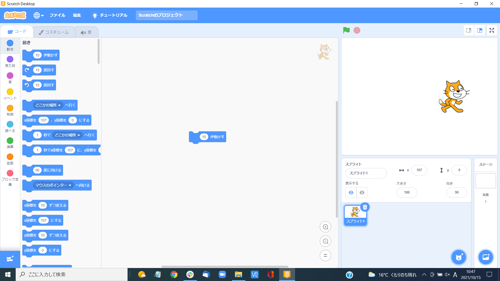
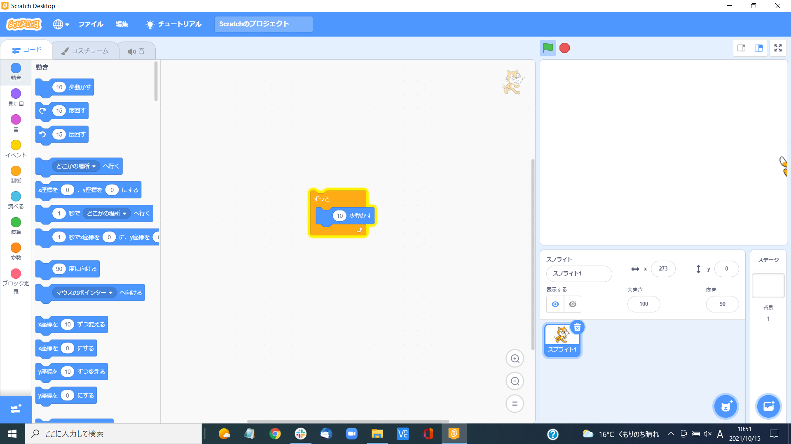
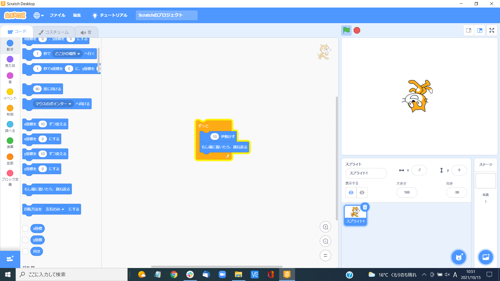
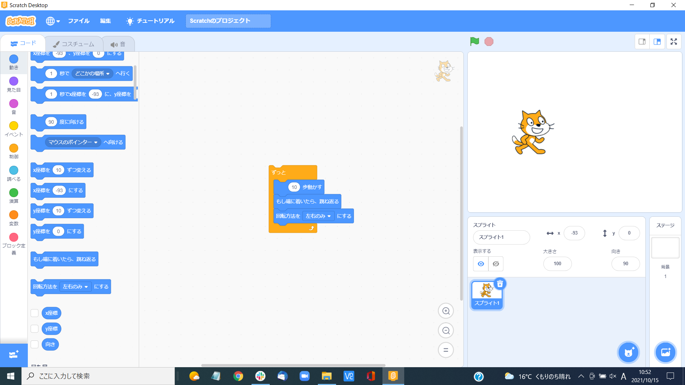

# 概要
- 20211015（金）13:05 〜
- Scratch3 ( Windows )

# オンライン版
- [Scratch](https://scratch.mit.edu/)

# 練習
- ブロックエリア > 動き > `10歩動かす`をコードエリアにドラッグ > ブロックをクリック

- ブロックエリア > 制御 > `ずっと`をコードエリアにドラッグ > ブロックをクリック

- ブロックエリア > 動き > `もし端に着いたら、跳ね返る`をコードエリアにドラッグ > ブロックをクリック

- ブロックエリア > 動き > `回転方向を左右のみ`をコードエリアにドラッグ > ブロックをクリック

