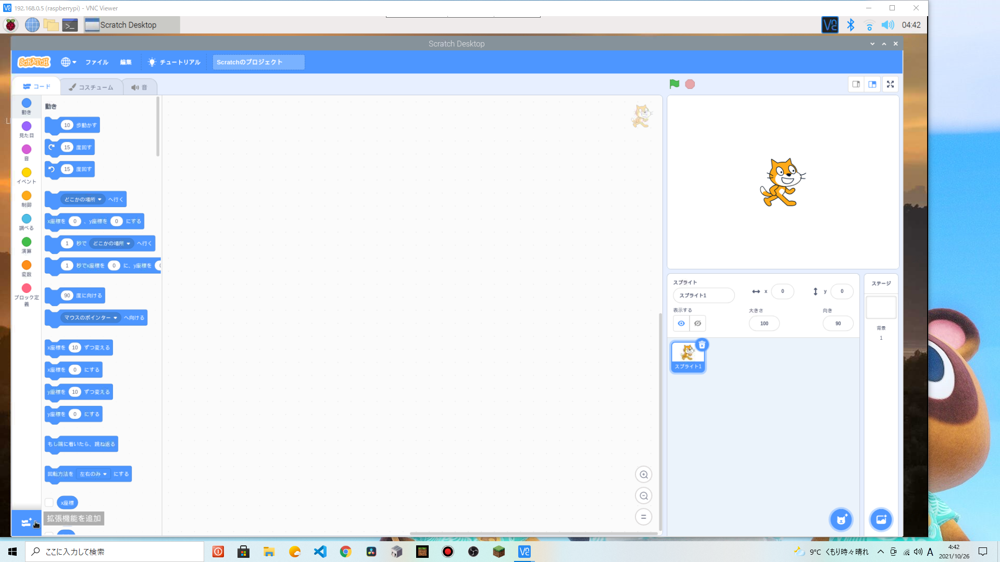
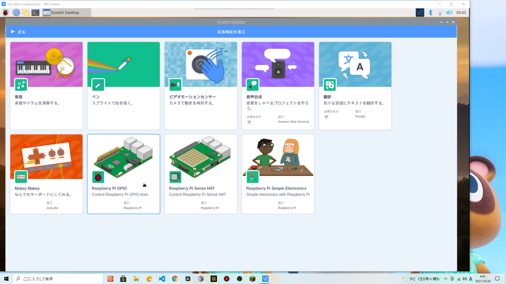
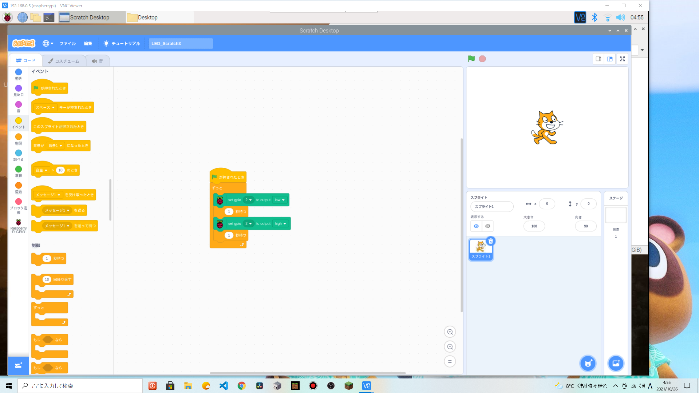

# 概要
- 20211027（水）13:05 〜
- L チカ
<p></p>

# GPIO とは
<center></center>
<p></p>

- ピン
- ポート
<p></p>

- 3.3 V （ピン番号 1, 17 ）
- 5 V （ピン番号 4 ）
- Ground （ピン番号 6, 9, 14, 20, 25, 30, 34, 39 ）
<p></p>

- 電流制限抵抗付きピン （ピン番号 3, 5 ）
- I2C EEPROM （ピン番号 27, 28 ）
<p></p>
<div style="page-break-before:always"></div>

## pinout コマンド

```
$ pinout
```

<center></center>
<p></p>
<div style="page-break-before:always"></div>

# プログラミングなしで LED 点灯

<center></center>
<p></p>

<center></center>
<p></p>

<div style="page-break-before:always"></div>

<center></center>
<p></p>

<center></center>
<p></p>
<div style="page-break-before:always"></div>

<center></center>
<p></p>

<center></center>
<p></p>
<div style="page-break-before:always"></div>

# Scratch3 の拡張機能で L チカ
- Scratch3 を起動し、拡張機能のボタンをクリック
<p></p>

<center></center>
<p></p>

- Raspberry Pi GPIO を選択
<p></p>

<center></center>
<p></p>
<div style="page-break-before:always"></div>

- プログラミング
- サンプル [LED_Scratch3.sb3](https://github.com/daily-tohoku-school/alec/blob/main/2021/day4/LED_Scratch3.sb3?raw=true)
<p></p>

<center></center>
<p></p>
<div style="page-break-before:always"></div>
