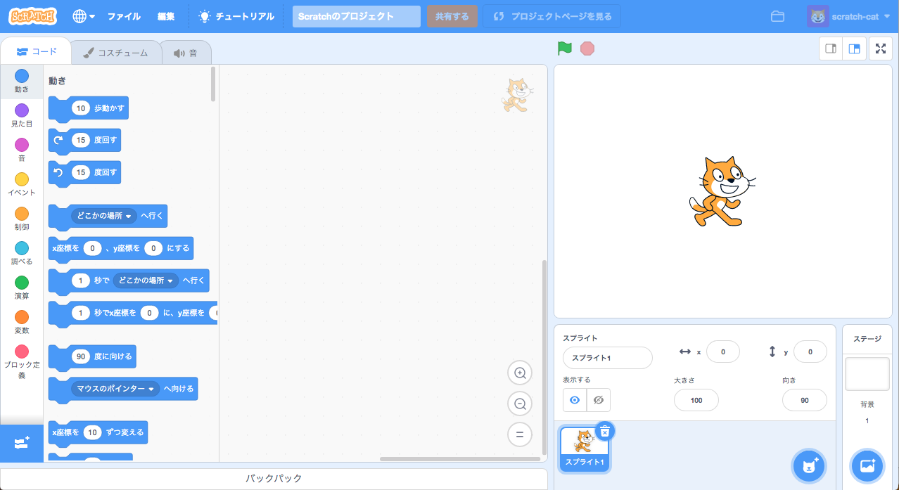
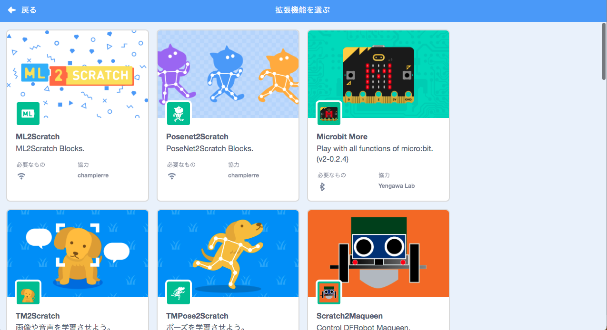
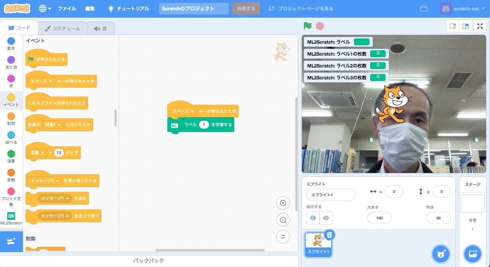
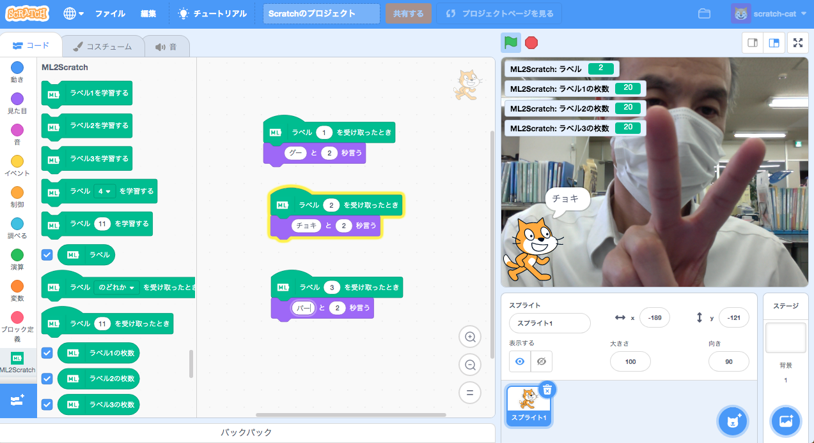

# 概要
- 20211027（水）13:05 〜
- カメラモジュール
- ML2Scratch

# Raspberry Pi OS 旧バージョンをインストール
- 現行の OS ( Release date: May 7th 2021 )にインストールされている Chromium が、カメラモジュールを認識しないため

## 参考サイト
- [旧バージョンのRaspbianのイメージファイルのダウンロード先](https://raspida.com/old-raspbian-download)

## ダウンロード
- [http://ftp.jaist.ac.jp/pub/raspberrypi/NOOBS/images/NOOBS-2020-02-14/](http://ftp.jaist.ac.jp/pub/raspberrypi/NOOBS/images/NOOBS-2020-02-14/)
- NOOBS_v3_3_1.zip をダウンロード
- zip を展開

## インストール
- 展開した中身のフォルダとファイルをフォーマットした microSD カードにコピー
- microSD カードを Raspberry Pi 本体にセットし、電源を入れてインストール開始

## コマンドで確認
`$ uname -a`

`Linux raspberrypi 4.19.97-v7l+ #1294 SMP Mon Jan 30 13:21:14 GMT 2020 armv7l GNU/Linux`

# カメラ設定と確認
## 設定
Raspberry Pi アイコン -> 設定 -> Raspberry Pi の設定 -> インターフェイス -> カメラ -> 有効 -> 再起動

## 確認
`$ vcgencmd get_camera`

`supported=1 detected=1` と表示されれば OK

## 試しに静止画を撮影する
`$ sudo raspistill -o image.jpg`

- 撮影した画像はホームディレクトリに保存される。

# ML2Scratch で機械学習
## 参考サイト
- [How to use(使い方)](https://github.com/champierre/ml2scratch#how-to-use%E4%BD%BF%E3%81%84%E6%96%B9)

## 手順
### 準備
- [https://stretch3.github.io/](https://stretch3.github.io/) を Chromium で開く

- 左下の拡張ボタンをクリック > ML2SCRATCH

- カメラの使用の許可

- `ラベル`、`ラベル1の枚数`、`ラベル2の枚数`、`ラベル3の枚数`をチェックオン
- コードエリアに`ラベル X を学習する`ブロックを配置する
- `ラベル X を学習する`ブロックの上に`スペースキーが押された時`ブロックを連結する

### 学習
- `グー`をカメラに映し、`ラベル 1 を学習する`ブロックを 20 枚の画像データを作成するまでクリック
- `チョキ`をカメラに映し、`ラベル 2 を学習する`ブロックを 20 枚の画像データを作成するまでクリック
- `パー`をカメラに映し、`ラベル 3 を学習する`ブロックを 20 枚の画像データを作成するまでクリック

### 予測
- 学習データ（モデル）を使って予測した結果がステージの`ラベル`に表示されます。

## モデルの保存
- `学習データをダウンロード`ブロックを使ってローカルに保存しておくこともできる。

