# 概要
- 20211027（水）13:05 〜
- カメラモジュール
- Teachable Machine

# Raspberry Pi OS 旧バージョンをインストール
- 現行の OS ( Release date: May 7th 2021 )にインストールされている Chromium が、カメラモジュールを認識しないため

## 参考サイト
- [旧バージョンのRaspbianのイメージファイルのダウンロード先](https://raspida.com/old-raspbian-download)

## ダウンロード
- [http://ftp.jaist.ac.jp/pub/raspberrypi/NOOBS/images/NOOBS-2020-02-14/](http://ftp.jaist.ac.jp/pub/raspberrypi/NOOBS/images/NOOBS-2020-02-14/)
- NOOBS_v3_3_1.zip をダウンロード
- zip を展開

## インストール
- 展開した中身のフォルダとファイルをフォーマットした microSD カードにコピー
- microSD カードを Raspberry Pi 本体にセットし、電源を入れてインストール開始

## コマンドで確認
`$ uname -a`

`Linux raspberrypi 4.19.97-v7l+ #1294 SMP Mon Jan 30 13:21:14 GMT 2020 armv7l GNU/Linux`

# カメラ設定と確認
## 設定
Raspberry Pi アイコン -> 設定 -> Raspberry Pi の設定 -> インターフェイス -> カメラ -> 有効 -> 再起動

## 確認
`$ vcgencmd get_camera`

`supported=1 detected=1` と表示されれば OK

## 試しに静止画を撮影する
`$ sudo raspistill -o image.jpg`

- 撮影した画像はホームディレクトリに保存される。

# Teachable Machine で機械学習
## 参考サイト
- [はじめよう！ AI プログラミング](https://services.google.com/fh/files/misc/ai_programming_booklet.pdf)

## 手順
### 準備
- [Teachable Machine](https://teachablemachine.withgoogle.com/) を Chromium で開く
- `使って見る`ボタンをクリック

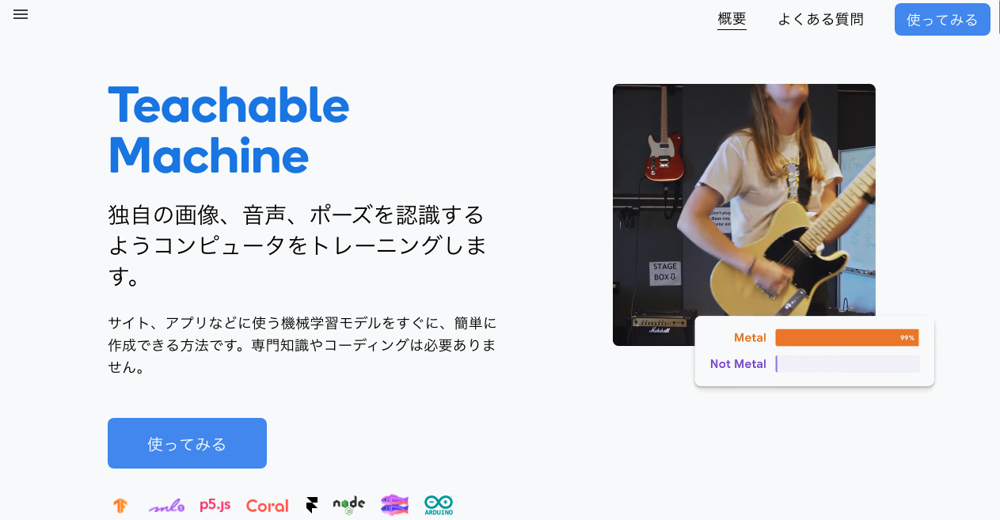

- `画像プロジェクト`をクリック

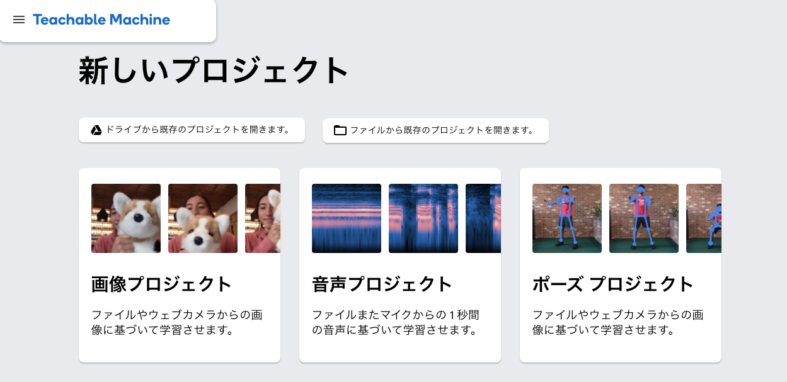

- `標準の画像モデル`をクリック

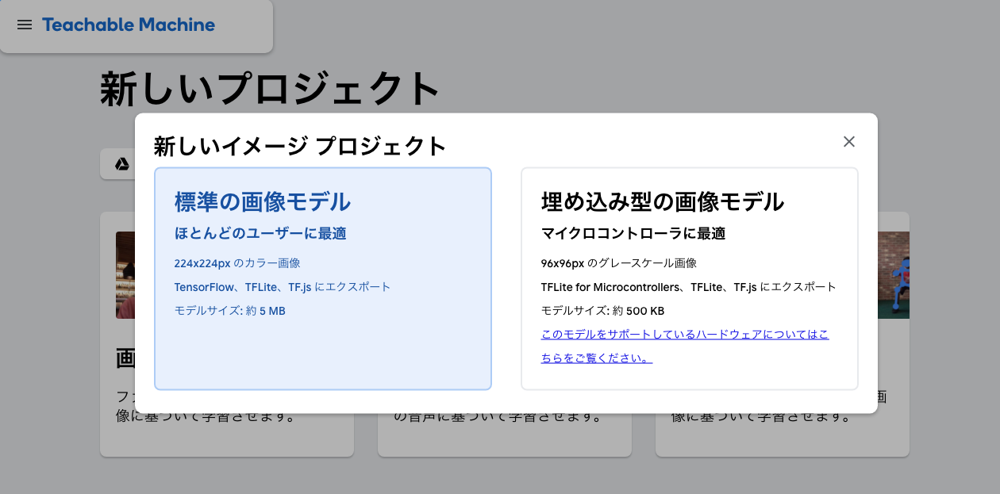

- `+ クラスを追加`をクリックし、4 つのクラスを準備する
- 鉛筆アイコンをクリックして Class 1 〜 4 を`グー`、`チョキ`、`パー`、`背景`に変更

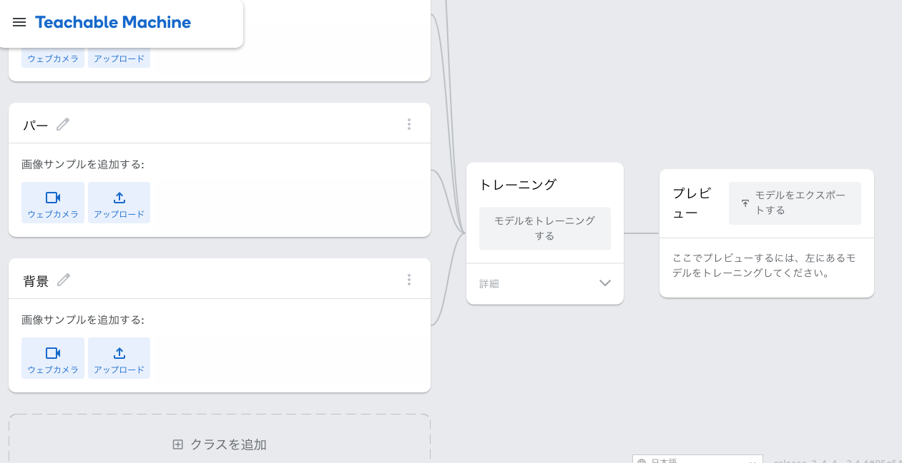

### 学習
- `ウェブカメラ`ボタンをクリックし、グーの手をカメラに写し、`長押しして録画`ボタンをクリック
- 20 枚以上の画像を撮影する
- 同様に`チョキ`、`パー`、`背景`を撮影する

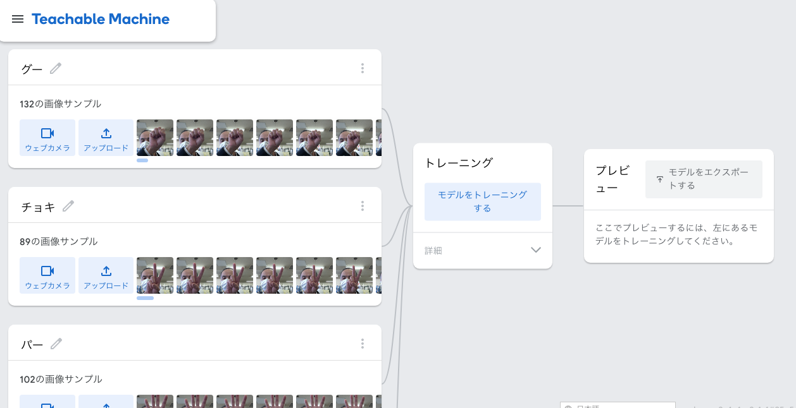

- `モデルをトレーニング`ボタンをクリック

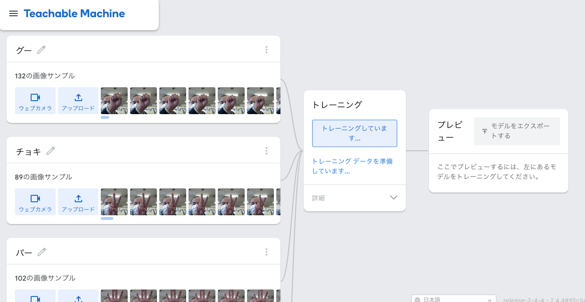

- `グー`、`チョキ`、`パー`をカメラに向かってかざし、プレビューでチェックする

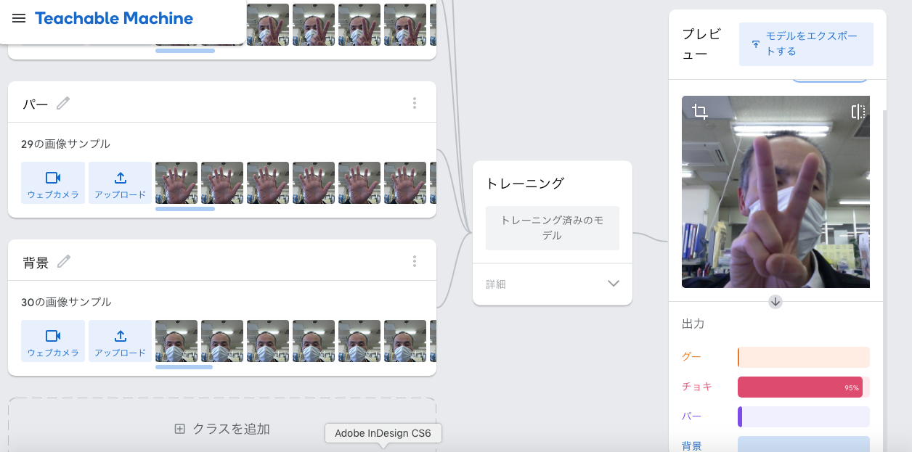

- `モデルをエクスポートする` > `モデルをアップロード`

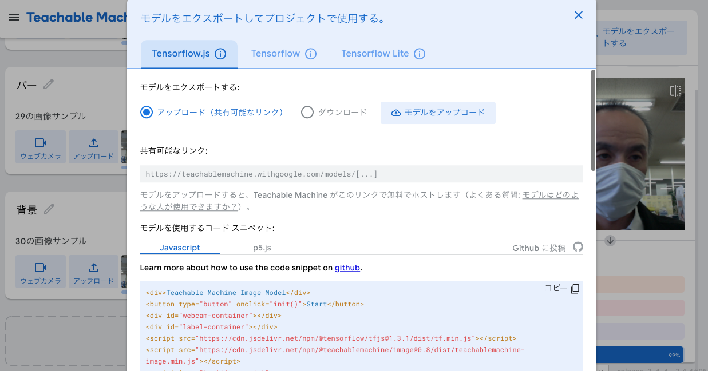

- `共有可能なリンク`をコピー

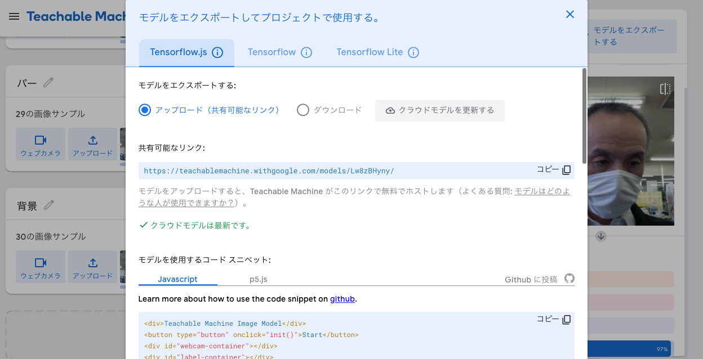

### 予測
- Stretch3 を開く

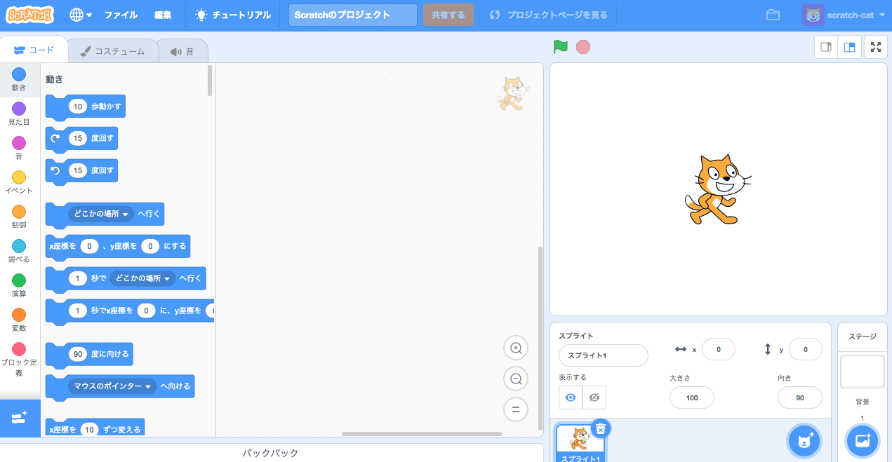

- 拡張機能 TM2Scratch を選択

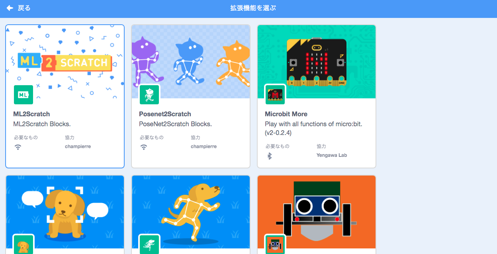

- 旗が押されたとき > 画像分類モデル URL

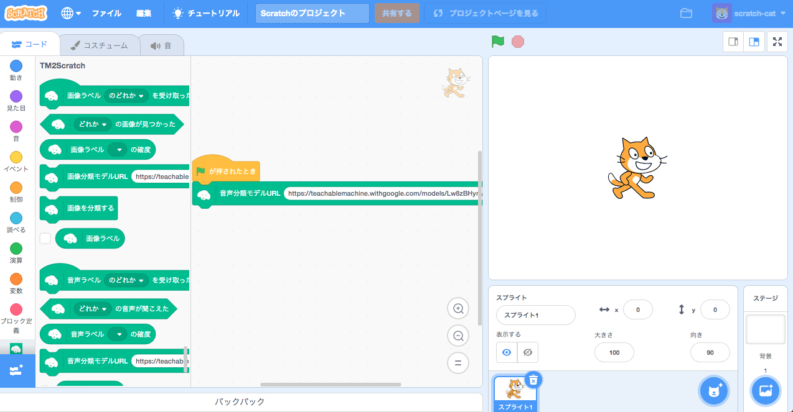

- `もしグーの画像が見つかったならグーと 2 秒言う`といったブロックを配置して予測結果を表示する

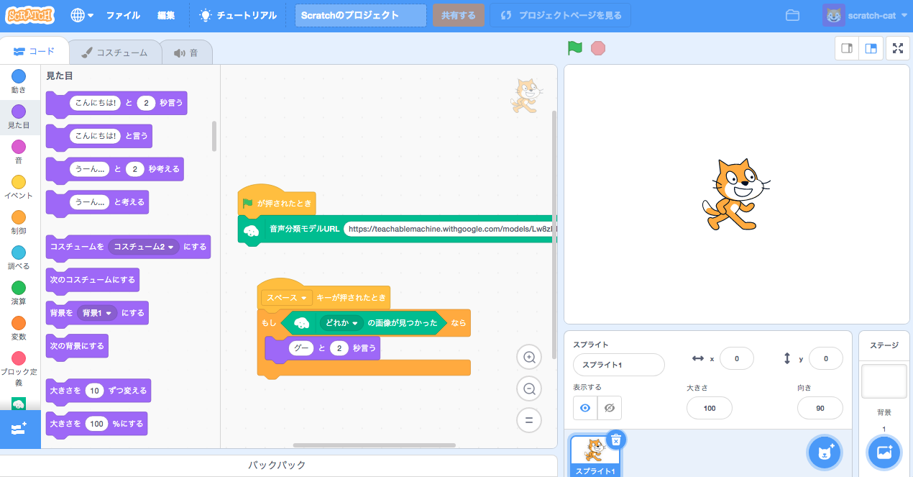

